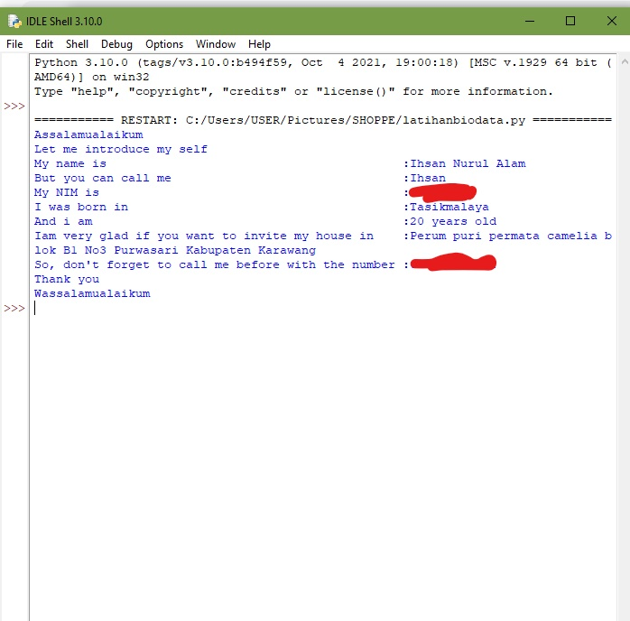

# pythonbiodata
membuat biodata di IDLE

## Contoh soal: Buatlah program untuk menginput biodata terdiri dari nama lengkap,nama panggilan,NIM,tempat lahir,usia,alamat,no telpon.Dalam bahasa inggris!
### Penyelesaian
Perintah memasukan salam
- print ("Assalamualaikum")
Perintah memasukan kata pembuka
- print ("let me introduce my self")
Perintah memasukan nama 
- print ("My name is     :nama")
Perintah memasukan nama panggilan
- print ("but you can call me   :nama panggilan")
Perintah memasukan NIM 
- print ("My nim Is    :nim")
Perintah memasukan tempat tanggal lahir
- print ("i was born in     :tempat lahir")
Perintah memasukan usia
- print ("and i am      :usia")
Perintah memasukan alamat
- print ("Iam very glad if you want to invite my house in    :alamat")
Perintah memasukan no hp
- print ("So, don't forget to call me before with the number :no hp")
Perintah memasukan kalimat penutup
- print ("Thank you")
Perintah memasukan salam penutup
- print ("Wassalamualaikum")
jika perintah sudah dimasukan,klik F5 (run module) untuk menjalankan program

maka hasil alhirnya akan seperti pada gambar di bawah

